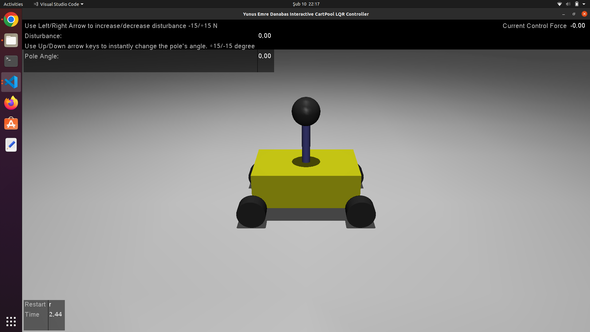

# Cart-Pole Swing-Up Control with JAX and MuJoCo

This repository implements controllers for the classic cart-pole swing-up task using both classical control methods and modern deep-learning techniques. We train a neural network controller via differentiable simulation to swing up the pole from a downward (or arbitrary) configuration to near upright—so that a simpler linear/LQR controller can later stabilize it. Real-time simulations are performed with MuJoCo and mujoco_viewer. 

For a complete discussion of the methodology, experiments, and results, please see our final report (ME58006_Project2.pdf) included in this repository.

---

## Overview

The cart-pole system comprises a cart that moves along a horizontal track and a pole hinged to the cart that can swing freely. Our objective is to design a controller that “pumps” energy into the system so that the pole reaches an upright equilibrium while keeping the cart near the center (x = 0). We compare several approaches:

- **Linear Controller:**  
  A controller trained in a differentiable JAX simulation using a quadratic cost on the state and control effort.
  
- **LQR Controller:**  
  A controller derived from a linearization of the nonlinear dynamics, computed via the algebraic Riccati equation.
  
- **Neural Network Controller:**  
  An MLP (multi-layer perceptron) policy trained via differentiable simulation with an energy-shaping plus cart-deviation cost. The NN takes a 5D state \([x, \cos\theta, \sin\theta, \dot{x}, \dot{\theta}]\) as input and outputs a scalar force to swing up the pole.

---

## Physical System & Objectives

The physical system is modeled as follows:

- **Cart:**  
  The cart (mass \(M\)) moves horizontally. Its position \(x\) should remain near zero to prevent instability.
  
- **Pole:**  
  The pole (mass \(m\) and length \(l\)) is attached by a hinge. The angle \(\theta\) is represented via its sine and cosine to avoid discontinuities. For the swing-up, the controller must inject enough energy so that the total mechanical energy (kinetic plus potential) reaches the desired level—typically,  
  \[
  E_{\text{des}} = 2\,m\,g\,l,
  \]  
  corresponding to the difference between the hanging and upright configurations.
  
- **Objective:**  
  Train the controller so that, starting from various (possibly challenging) initial conditions, the system is driven to near the upright equilibrium. Once there, a simpler LQR (or linear) controller can take over to achieve fine stabilization.

---

## Techniques & Libraries

- **JAX:**  
  Provides automatic differentiation and JIT compilation for efficient computation.
  
- **Equinox:**  
  A lightweight neural network library used to define and manage our MLP controller.
  
- **Optax:**  
  Supplies gradient-based optimizers (e.g., Adam) to train the neural network.
  
- **Diffrax:**  
  Enables differentiable ODE integration, which is critical for rollout-based cost evaluation during training.
  
- **MuJoCo & mujoco_viewer:**  
  High-fidelity physics simulation and real-time visualization of the cart-pole system.
  
- **Classical Control Methods:**  
  Linear and LQR controllers are implemented for baseline performance and comparison.

---

## Project Structure

- **`controller/`**  
  - `linear_controller.py`: Implements the linear controller and its training routine.  
  - `lqr_controller.py`: Contains functions for linearizing the cart-pole system and computing the LQR gain matrix.  
  - `neuralnetwork_controller.py`: Defines the MLP (or `CartPolePolicy`) used for neural network control.
  
- **`env/`**  
  - `cartpole.py`: Contains the nonlinear cart-pole dynamics.  
  - `closedloop.py`: Provides a wrapper for closed-loop simulation using Diffrax.
  
- **`lib/`**  
  - `trainer.py`: Implements the training loop for the neural network controller using an energy-shaping plus cart-deviation loss.  
  - `utils.py`: Contains helper functions for sampling initial conditions and plotting trajectories, energies, and costs.
  
- **Main Scripts:**  
  - `main_linear_only.py`: Trains and tests the linear controller and LQR in the JAX simulation environment.  
  - `mujoco_lqr_controller_interactive.py`: Runs an interactive LQR controller in MuJoCo with overlays and keyboard controls.  
  - `mujoco_linear_control.py`: Implements the trained linear controller in a MuJoCo simulation.  
  - `nn_mujoco.py`: Deploys the trained neural network controller in MuJoCo.  
  - `train_nn_controller.py`: Trains the neural network controller using differentiable simulation and rollout cost minimization.

- **Additional Files:**  
  - `ME58006_Project2.pdf`: A final report detailing the project methodology, experiments, and results.  
  - `mujoco_lqr_controller_interactive.png`: A screenshot from the interactive LQR simulation.

---

## How It Works

1. **Differentiable Simulation & Training:**  
   The training process uses Diffrax to simulate the cart-pole dynamics over a fixed time horizon. The cost function penalizes the squared error between the current energy (kinetic plus potential) and the desired energy for the upright state, along with deviations of the cart from the center and excessive control force. The neural network controller is then trained using gradient descent (via Optax).

2. **Neural Network Policy:**  
   The MLP receives a 5D state \([x, \cos\theta, \sin\theta, \dot{x}, \dot{\theta}]\) and outputs a force. The training objective is designed to drive the system to a state with the desired energy level while keeping the cart’s position near zero.

3. **Classical Controllers:**  
   In parallel, a linear controller (trained in a differentiable environment) and an LQR controller (obtained by linearizing the system dynamics) are implemented for comparison.

4. **Real-Time Simulation with MuJoCo:**  
   The trained controllers are deployed in MuJoCo for high-fidelity, real-time simulation. Interactive scripts (such as the one using LQR with overlays) allow users to visualize disturbances, adjust parameters via keyboard, and observe the system’s behavior.

---

## Screenshot

  
*Screenshot from the interactive LQR simulation showing real-time control overlays and disturbance information.*

---

## Installation & Requirements

- **Python 3.8+**
- **JAX** (with CPU or GPU support)
- **Equinox**
- **Optax**
- **Diffrax**
- **MuJoCo 3.x** and **mujoco_viewer**
- **Matplotlib** and **NumPy**

Install the required packages via pip:
```bash
pip install jax jaxlib equinox optax diffrax mujoco mujoco_viewer matplotlib numpy
```
Make sure MuJoCo is installed and licensed correctly on your system.

---

## Usage

- **Training:**  
  Run `train_nn_controller.py` to train the neural network controller for the swing-up task. The trained model is saved as `trained_nn_model.eqx`.

- **Simulation & Testing:**  
  Use the provided scripts (`main_linear_only.py`, `mujoco_lqr_controller_interactive.py`, `mujoco_linear_control.py`, `nn_mujoco.py`) to simulate and compare the performance of the different controllers in both differentiable and real-time MuJoCo environments.

- **Visualization:**  
  Utility functions in `lib/utils.py` enable plotting of trajectories, energy profiles, and cost comparisons.

- **Final Report:**  
  Refer to `Final_Report.pdf` for a comprehensive discussion of the methodology, experimental setup, and results.

---

## Future Work

- **Controller Handoff:**  
  Develop a mechanism to switch from the NN controller to an LQR controller once the system reaches near-upright.
- **Enhanced Cost Functions:**  
  Experiment with additional or phase-based loss terms.
- **Robustness Testing:**  
  Further test the controllers under various disturbances and initial conditions.
